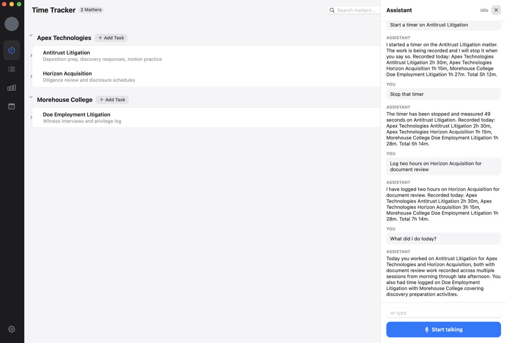
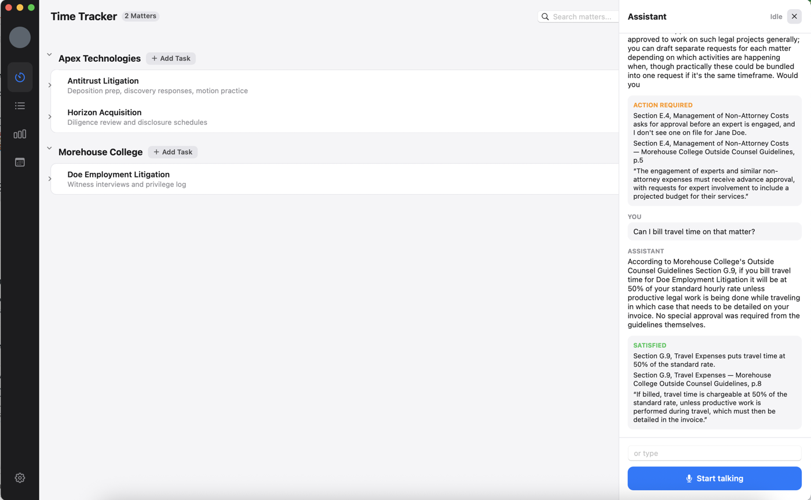

# Time Tracker

A legal assistant that keeps your billable hours. You talk to it.

Everything runs on your own machine. Your matters, your hours and your clients'
guidelines never leave it.

## What it does

Start and stop timers, log work you already did, fix an entry you got wrong, and
ask what the day adds up to. Out loud, while you are doing something else, so
the timesheet stops being an hour of your evening.



It also knows your clients' outside counsel guidelines. Ask before you take on
the work, not after the invoice comes back short:

```
> Can our associate Jane Doe attend the Apex litigation deposition?

Section 3.2, Approved Timekeepers: "Timekeepers who do not appear on the
approved staffing plan require written authorization from the supervising
attorney before performing any billable work."

The authorisation on file was decided August 12th, which is after the work
would start. Jane Doe is not on the approved list for this matter.
Want me to draft the request?

> Yes. Estimate five hours.

Drafted for Mary Major, the supervising attorney on that matter.
Nothing has been sent.
```

It answers with the section, quotes it, and shows you the page. When the client
has to sign off on something it writes the request and leaves it for you to
read and send.



## Setup

You need macOS 13 or later on Apple silicon, CMake, Ninja, the Xcode command
line tools, and [Ollama](https://ollama.com) running:

```sh
ollama pull qwen3.5:4b
```

Then the speech models, about 520 MB and not in the repo:

```sh
mkdir -p models && cd models

curl -L -o ggml-base.en.bin \
  https://huggingface.co/ggerganov/whisper.cpp/resolve/main/ggml-base.en.bin

curl -L -O \
  https://github.com/k2-fsa/sherpa-onnx/releases/download/tts-models/kokoro-multi-lang-v1_0.tar.bz2
tar xf kokoro-multi-lang-v1_0.tar.bz2 && rm kokoro-multi-lang-v1_0.tar.bz2
```

Build it:

```sh
cmake -B build -G Ninja -DTT_ENABLE_VOICE=ON
cmake --build build
open build/TimeTracker.app
```

The first configure pulls down whisper.cpp and sherpa-onnx, so give it ten
minutes. After that a build is seconds.

## Using it

The window opens on your matters. Press **AI Assistant**, then push the button
and talk. Push it again when you are done. The space bar does the same thing.

```
start a timer on the Northgate roof repair
stop that timer
log two hours on Horizon Acquisition for document review
make that ninety minutes instead
what did I do today?
can I bill the drive down to the deposition?
```

You can also add matters, start timers and delete entries by hand, if talking is
not appropriate at that moment.

There is a `tt` command in the same build if you would rather type than talk.

## The example data

`data/preflight_seed.json` has the guidelines the assistant reads. The Morehouse
College rules are quoted from their published outside counsel guidelines, with
the real sections and page numbers, and the PDF is in `example_OCG/` if you want
to check them. Apex Technologies is made up, and says so in every answer it
appears in.
